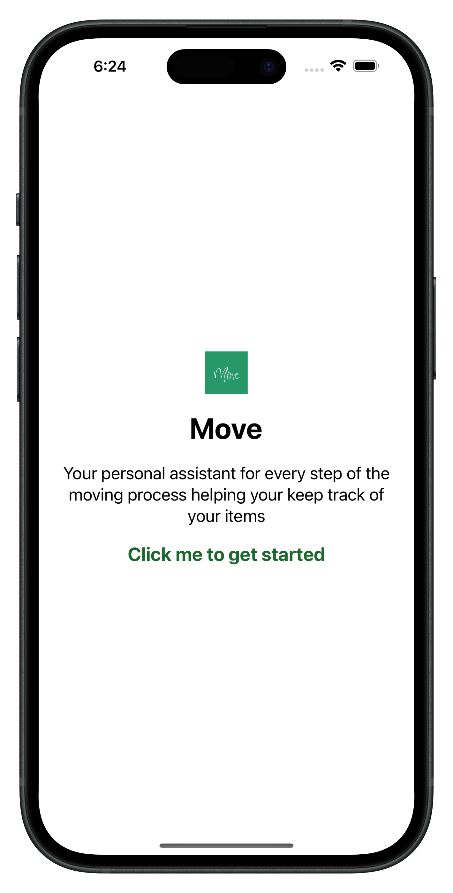
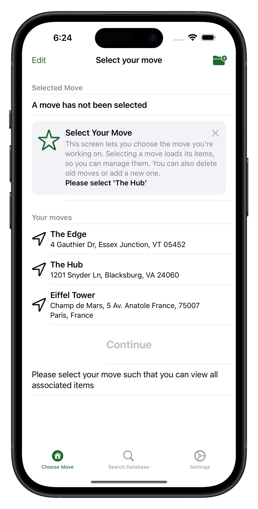
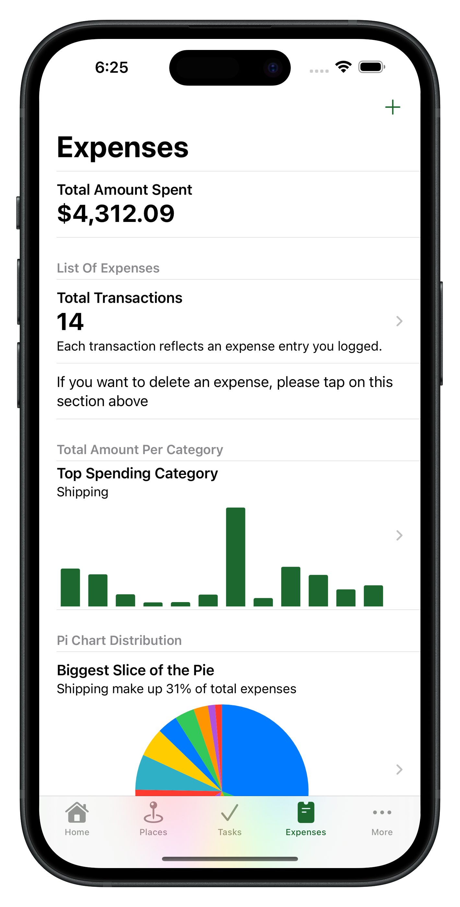
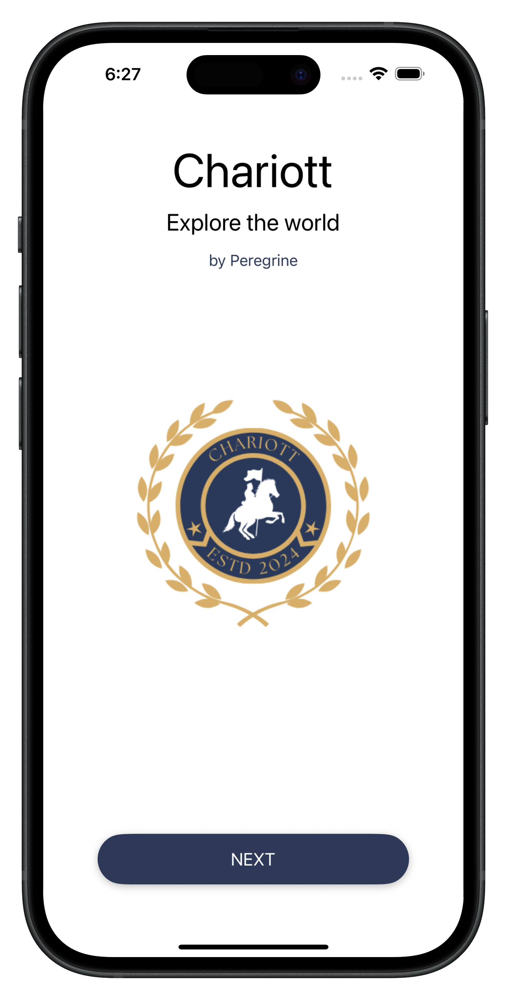
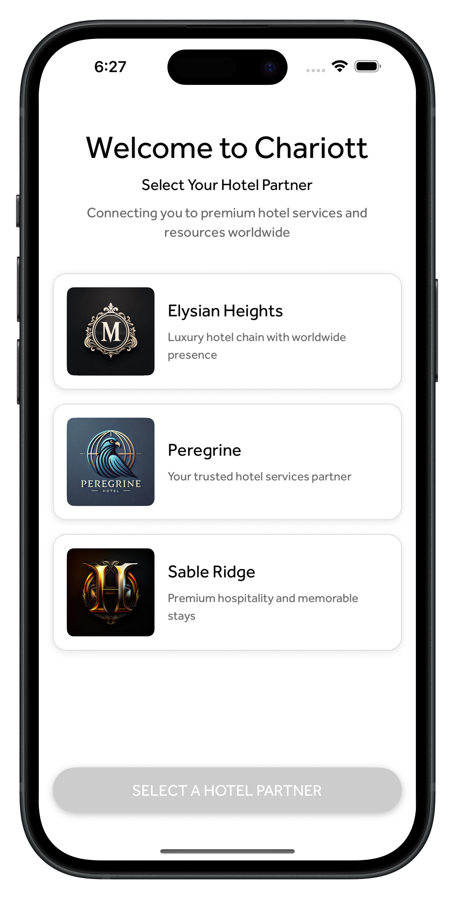
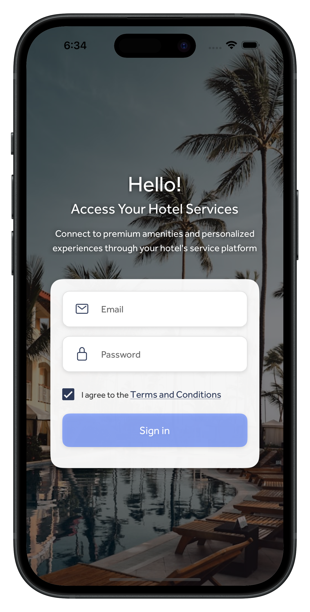
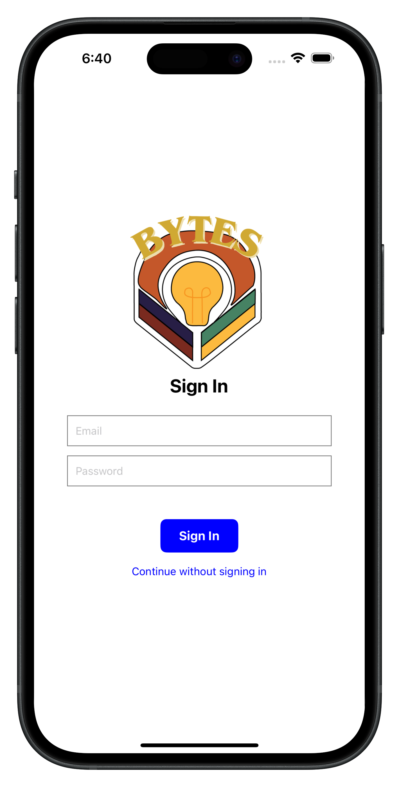

# Mobile Projects Portfolio

## 📱 [Moving Assistant - Native iOS App](https://www.youtube.com/watch?v=tguY241cjDc)
*SwiftUI • MapKit • Google API • SwiftData • TipKit • Swift Charts • UIKit • AVFoundation*

 

  
  
  

**Overview**  
A comprehensive iOS application designed to streamline the moving process by enabling users to manage tasks, expenses, flights, and local exploration all in one place.

**🎯 Key Features**
- **Task Management**: Organize and track moving-related tasks
- **Expense Tracking**: Monitor moving costs with visual charts
- **Flight Planning**: Integrated flight search and booking assistance
- **Local Exploration**: Discover points of interest in new locations
- **Inventory System**: QR code generation and scanning for box tracking
- **Real-time Data**: Google Places API integration for location services

**🏆 Achievement**
- Managed a team of 3 developers
- Achieved **97/100** final project grade
- Led technical debugging and troubleshooting efforts

**🛠 Technical Implementation**
- **Architecture**: MVVM pattern for clean code separation
- **Data Persistence**: SwiftData for local storage
- **Mapping**: MapKit with custom annotations
- **User Guidance**: TipKit for onboarding experience
- **Media Processing**: AVFoundation for camera integration
- **API Integration**: RESTful services for real-time data

---

## 🏨 [Chariot CodeFest - Hospitality App](https://github.com/michaelodusami/reactnative-charriot)
*React Native • Expo Go • FastAPI • AWS*

 

  
  
  

**Overview**  
A hospitality application prototype developed for Marriott in under 48 hours, designed to enhance user satisfaction through innovative features and multilingual support.

**🎯 Key Features**
- **Multilingual Chatbot**: REST API powered conversational interface
- **User Preferences**: Personalized experience customization
- **Booking History**: Comprehensive reservation management
- **Real-time Communication**: Instant customer service integration

**🏆 Achievement**
- **🥇 1st Place Winner** at Marriott CodeFest
- Application rights transferred to Marriott
- Completed in 48-hour hackathon format
- Implemented 1-hour sprint methodology

**🛠 Technical Implementation**
- **Frontend**: React Native with Expo for rapid development
- **Backend**: FastAPI for high-performance API services
- **Cloud Infrastructure**: AWS for scalable deployment
- **Integration**: RESTful API architecture
- **Collaboration**: Agile development with sprint cycles

---

## 📰 [Bytes - News Platform](https://github.com/michaelodusami/reactnative-bytes)
*React Native • Expo Go • MongoDB • FastAPI • Text-to-Speech*

 

  

**Overview**  
An innovative news consumption platform that combines TikTok-style reels functionality with up-to-date news content, featuring accessibility enhancements and personalized content delivery.

**🎯 Key Features**
- **Reels Interface**: TikTok-inspired vertical scrolling for news consumption
- **Real-time News**: NewsAPI integration for current events
- **Text-to-Speech**: Accessibility feature for visually impaired users
- **Content Categorization**: Personalized news feed based on user preferences
- **Feedback Loop**: User engagement tracking and content optimization

**🏆 Achievement**
- **🏅 UVA Best Accessibility Award** - React Native category
- Focus on inclusive design and accessibility features

**🛠 Technical Implementation**
- **Frontend**: React Native with TypeScript for type safety
- **Database**: MongoDB for flexible content storage
- **Backend**: FastAPI for efficient API development
- **Accessibility**: Text-to-Speech engine integration
- **API Integration**: NewsAPI for real-time content delivery
- **User Experience**: Swipe-based navigation similar to social media platforms
